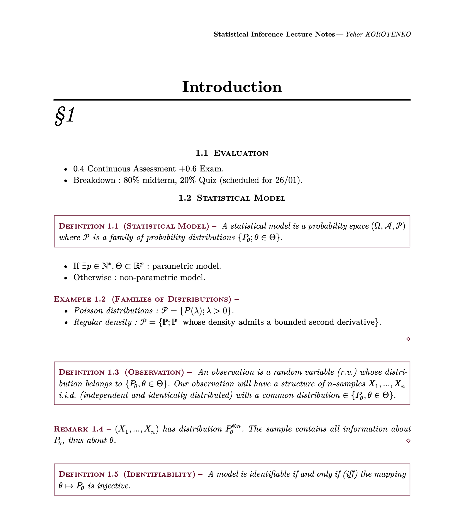

# Typst local packages
It is my `typst/packages/local` directory where I store my packages. One of such packages is `dobbikov` for documents that look like standard **LaTeX** report with set of beautifully styled theorems.

`dobbikov` package was initially copied from someone else that I don't remember the name anymore, then it was had been changed a lot. If I find initial author, I will add it here. 

Example of documents written with dobbikov package:
- [Statistical Inference Lecture Notes](https://dobbikov.github.io/semester6-lecture-notes/stats_en.pdf)

## ToDo
Write docs for `dobbikov` package, at least for me.
